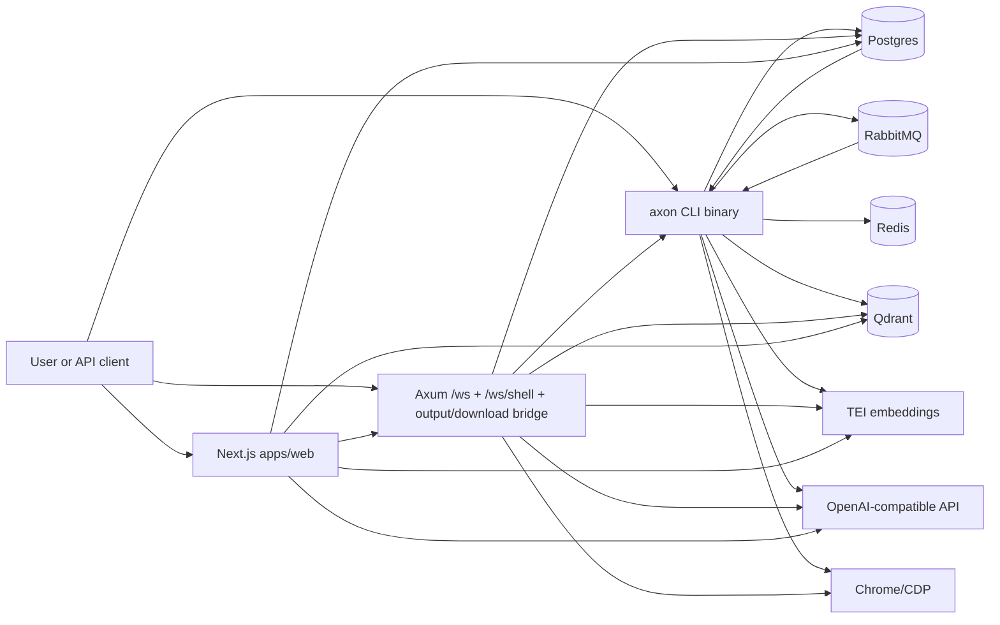
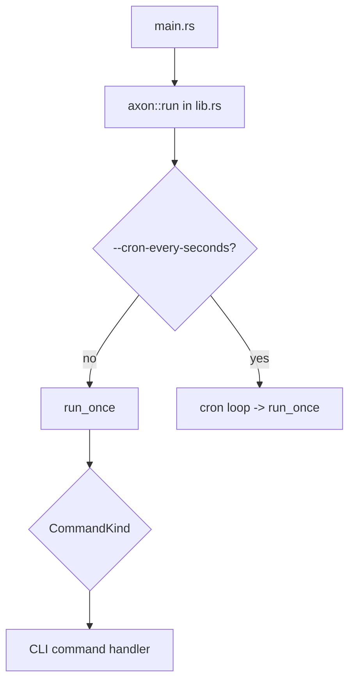
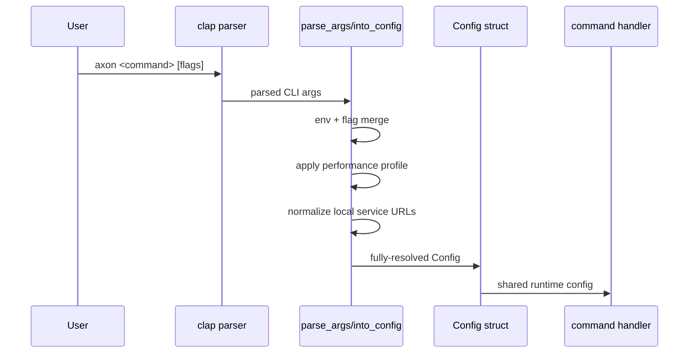
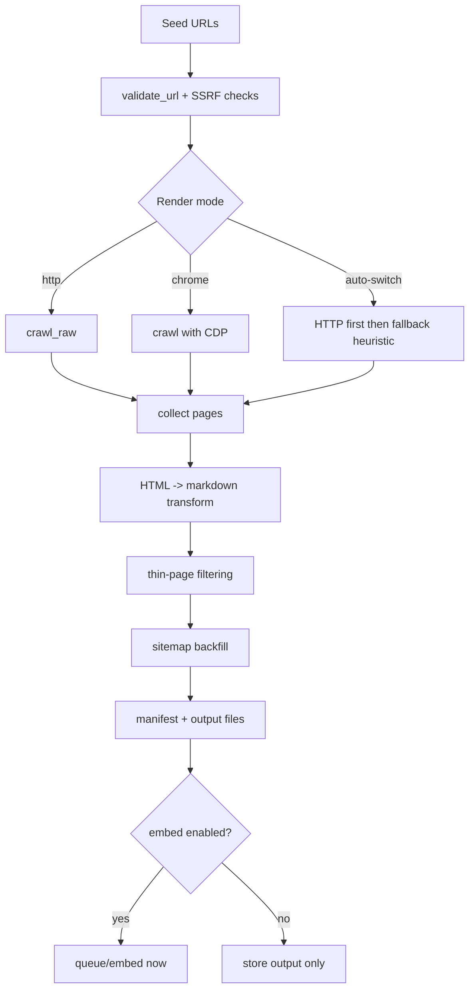
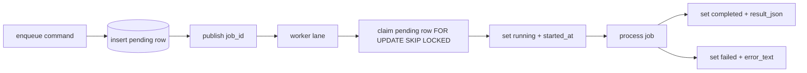
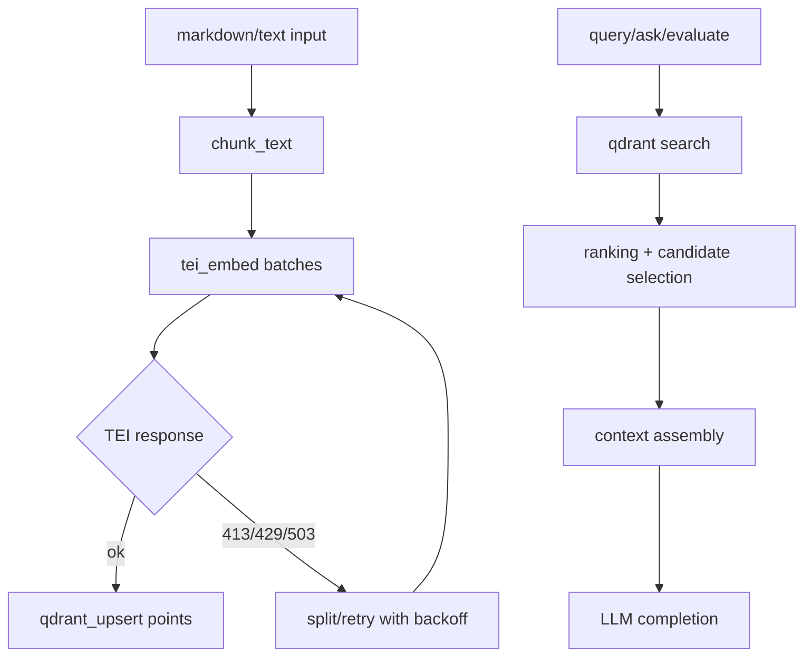
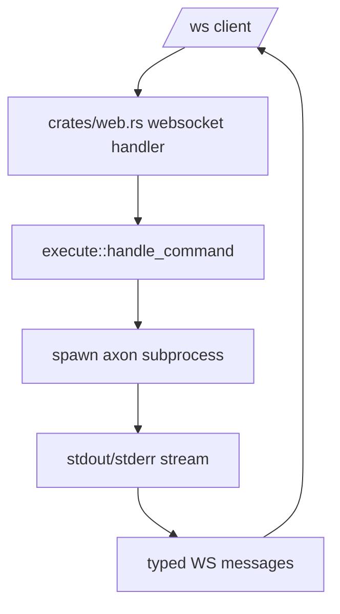
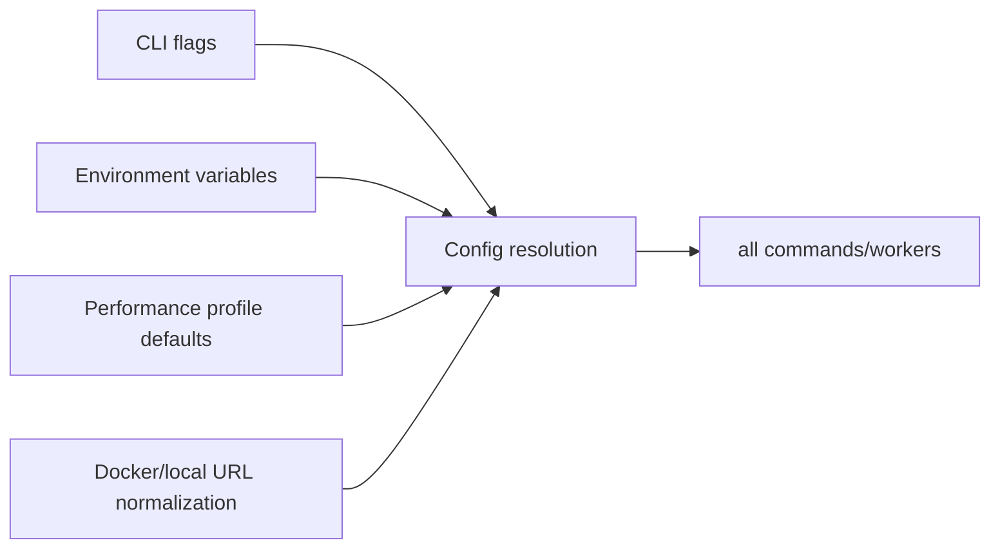

# Axon Architecture
Last Modified: 2026-03-03

Version: 1.0.0
Last Updated: 01:26:53 | 02/25/2026 EST

## Table of Contents

1. [Purpose and Scope](#purpose-and-scope)
2. [System Context](#system-context)
3. [Runtime Components](#runtime-components)
4. [Execution Entry Points](#execution-entry-points)
5. [CLI and Config Flow](#cli-and-config-flow)
6. [Crawl and Content Pipeline](#crawl-and-content-pipeline)
7. [Async Job Architecture](#async-job-architecture)
8. [Vector and RAG Pipeline](#vector-and-rag-pipeline)
9. [Web Runtime Architecture](#web-runtime-architecture)
10. [Omnibox and Pulse Flows](#omnibox-and-pulse-flows)
11. [Data Model and Persistence](#data-model-and-persistence)
12. [Configuration Resolution](#configuration-resolution)
13. [Failure Handling and Recovery](#failure-handling-and-recovery)
14. [End-to-End Flows](#end-to-end-flows)
15. [Key Source Map](#key-source-map)

## Purpose and Scope

This document defines the current architecture of `axon_rust` across:

- CLI command execution and dispatch
- Crawl/extract/embed/ingest asynchronous pipelines
- Vector storage and retrieval (Qdrant + TEI)
- Web runtimes (`serve` websocket/download bridge and `apps/web` Next.js UI)
- Omnibox/pulse interaction and data flow

It supersedes the previous omnibox-only architecture note.

## System Context



## Runtime Components

| Component | Role |
|---|---|
| `main.rs` + `lib.rs` | Binary entry and top-level command loop/dispatch |
| `crates/cli/*` | Command handlers and subcommand routing |
| `crates/core/*` | Config parsing, HTTP safety, content transforms, logging |
| `crates/crawl/*` | Crawl engine, render mode strategy, sitemap backfill |
| `crates/jobs/*` | Queue-backed worker runtime + job state transitions |
| `crates/vector/*` | Embed/query/retrieve/ask/evaluate/suggest operations |
| `crates/web.rs` + `crates/web/*` | Axum web server, websocket execution bridge, output/download endpoints |
| `apps/web/*` | Next.js UI with omnibox, results rendering, pulse workspace |
| `docker-compose.yaml` | Self-hosted runtime services |

## Execution Entry Points



- `main.rs` loads `.env` and invokes `axon::run`.
- `lib.rs` owns run-loop concerns (logging init, optional cron, dispatch to handlers).
- Command dispatch is centralized in `run_once` using `CommandKind`.

## CLI and Config Flow



Key points:

- Argument schema is defined in `crates/core/config/cli.rs` and `crates/core/config/cli/global_args.rs`.
- Parsing/normalization is in `crates/core/config/parse.rs`.
- Effective runtime settings are stored in `crates/core/config/types/config.rs::Config`.
- URL seed handling is consolidated in `crates/cli/commands/common.rs` (`parse_urls`, `start_url_from_cfg`).

## Crawl and Content Pipeline



Key responsibilities:

- HTTP safety, SSRF guarding, and client setup in `crates/core/http.rs`.
- Content transformation and markdown extraction in `crates/core/content.rs`.
- Crawl orchestration in `crates/crawl/engine.rs`.
- Auto-switch mode evaluates crawl quality and can rerun with Chrome.
- Sitemap backfill extends coverage beyond direct traversal.

## Async Job Architecture

Jobs are persisted in Postgres and queued through RabbitMQ. Workers consume from queues but Postgres is the source of truth for state.



State model:

- Shared statuses in `crates/jobs/status.rs`: `pending`, `running`, `completed`, `failed`, `canceled`.
- Atomic claim/fail/update helpers in `crates/jobs/common/job_ops.rs`.
- Worker lane orchestration in `crates/jobs/worker_lane.rs`.
- Stale job watchdog in `crates/jobs/common/watchdog.rs`.

Job families:

- Crawl: `crates/jobs/crawl/runtime/worker/loops.rs` (own AMQP consumer loop — see Worker Architecture below)
- Extract: `crates/jobs/extract/worker.rs` (uses `worker_lane.rs`)
- Embed: `crates/jobs/embed/worker.rs` (uses `worker_lane.rs`)
- Ingest (`github`, `reddit`, `youtube`, `sessions`): `crates/jobs/ingest.rs` (uses `worker_lane.rs`)
- Refresh: `crates/jobs/refresh/worker.rs` (uses `worker_lane.rs`; lifecycle details in `docs/JOB-LIFECYCLE.md`)

### Worker Architecture

#### Generic Worker Lane (worker_lane.rs)

`worker_lane.rs` provides a generic AMQP/polling consumer loop shared by:
- Embed worker (`crates/jobs/embed/worker.rs`)
- Extract worker (`crates/jobs/extract/worker.rs`)
- Refresh worker (`crates/jobs/refresh/worker.rs`)
- Ingest worker (`crates/jobs/ingest.rs`)

Each worker type creates N lanes (configurable via `AXON_*_LANES` env vars).
Each lane holds one AMQP consumer channel and processes jobs sequentially.

#### Why the Crawl Worker Doesn't Use worker_lane.rs

The crawl worker has its own AMQP consumer loop in `crates/jobs/crawl/runtime/worker/loops.rs`.

**Root cause**: `spider.rs` futures are `!Send`. They cannot be:
- Spawned with `tokio::spawn()` (requires `Send + 'static`)
- Moved across thread boundaries (including `FuturesUnordered`)

The crawl worker works around this by pinning futures with `tokio::pin!()` and
polling them inside a `select!` loop on a single task. This preserves the
1-job-per-lane guarantee while keeping the non-Send future alive on the same thread.

**Consequence**: Any change to the generic lane logic (backoff, QoS, reconnect) must
also be manually applied to `crawl/runtime/worker/loops.rs`. The two reconnect loops
also have subtly different backoff reset semantics (see `CLAUDE.md` "AMQP reconnect backoff").

## Vector and RAG Pipeline



Key behaviors:

- Embedding implementation in `crates/vector/ops/tei.rs`.
- Qdrant operations and collection lifecycle in `crates/vector/ops/qdrant/*`.
- Command-level vector flows in `crates/vector/ops/commands/*`.
- Ingest sources eventually call vector embedding paths so all content lands in Qdrant with metadata.

## Web Runtime Architecture

The web UI is `apps/web` (Next.js). `crates/web.rs` provides the axum WebSocket bridge it connects to.

### Axum Runtime (`serve`)



Capabilities:

- Serves websocket bridge endpoints plus output/download artifact routes.
- Maintains per-connection command/crawl state.
- Streams command output/events over websocket.
- Broadcasts Docker stats via `crates/web/docker_stats.rs`.

## Omnibox and Pulse Flows

### Unified UI Data Flow (Next.js)

```mermaid
flowchart TD
  U[User] --> O[Omnibox]
  O --> MT{mode type}

  MT -->|command mode| EX[startExecution -> WS execute]
  EX --> WS[useAxonWs + useWsMessages]
  WS --> RP[ResultsPanel]

  MT -->|workspace mode pulse| AW[activateWorkspace]
  O --> SP[submitWorkspacePrompt]
  AW --> RP
  SP --> PW[PulseWorkspace]
  PW --> API[/api/pulse/chat]
  API --> PW
  PW --> RP
```

### Mention System

`Omnibox` supports mention-driven interaction:

- `@mode` mentions switch mode without mouse interaction.
- `@file` mentions use `/api/omnibox/files` for local fuzzy file selection.
- Mentioned files can be inserted as query context.

### Pulse Workspace Behavior

- Workspace state is coordinated by `useWsMessages`.
- Pulse prompt execution is gated by workspace prompt versioning so repeat prompt submissions still execute.
- Pulse does not use the websocket `execute` command path; it uses Next.js API routes.

## Data Model and Persistence

Primary relational tables (see `docs/SCHEMA.md`):

- `axon_crawl_jobs`
- `axon_extract_jobs`
- `axon_embed_jobs`
- `axon_ingest_jobs`
- `axon_refresh_jobs`
- `axon_refresh_targets` (per-URL conditional request state)
- `axon_refresh_schedules` (recurring refresh definitions)

Common columns:

- `id`, `status`, `created_at`, `updated_at`, `started_at`, `finished_at`, `error_text`, `config_json`, `result_json`

Ingest-specific discriminator:

- `source_type` + `target` replace URL-based identifiers.

Refresh-specific:

- `urls_json` array of URLs to re-check.
- `axon_refresh_targets` stores per-URL ETag/hash state across jobs.
- `axon_refresh_schedules` defines recurring refresh intervals.

Storage responsibilities:

- Postgres: job metadata and lifecycle state
- RabbitMQ: queue delivery
- Redis: cancellation/control and health paths
- Qdrant: vector points + retrieval corpus

## Configuration Resolution



Important behavior:

- Container DNS endpoints are normalized for local execution when needed.
- Profiles (`high-stable`, `balanced`, `extreme`, `max`) apply batch, timeout, retry, and concurrency defaults.
- Queue names and collection names are centrally configurable.

## Failure Handling and Recovery

Resilience patterns implemented:

- Atomic row claiming prevents duplicate worker ownership.
- Watchdog can reclaim stale `running` jobs.
- Embedding retries handle transient TEI overload and payload limits.
- Command/output streams include typed error events over websocket.
- Job subcommands (`status`, `errors`, `list`, `recover`, `cancel`) provide operational control.

## End-to-End Flows

### 1) Crawl with Async Queue

1. User runs `axon crawl <url>` (default async).
2. Command inserts `pending` job row and publishes job id to queue.
3. Worker claims row, marks `running`, executes crawl.
4. Results and artifacts are written, optional embedding happens.
5. Job row is finalized with `completed` or `failed`.

### 2) Ask/RAG Query

1. User runs `axon ask <question>` or pulse sends a chat request.
2. Query retrieves candidates from Qdrant.
3. Ranking/context assembly builds prompt context.
4. LLM endpoint generates final answer.

### 3) Next.js Omnibox Command Execution

1. User focuses omnibox (`/`) and enters command input.
2. `startExecution` sends websocket `execute` message.
3. Axum websocket handler spawns CLI command.
4. Streamed events update `useWsMessages` state.
5. `ResultsPanel` renders output, crawl files, errors, or artifacts.

## Key Source Map

Core runtime:

- `main.rs`
- `lib.rs`
- `crates/core/config/cli.rs`
- `crates/core/config/cli/global_args.rs`
- `crates/core/config/parse.rs`
- `crates/core/config/types/config.rs`
- `crates/core/config/types.rs`
- `crates/core/http.rs`
- `crates/core/content.rs`

Crawl/jobs/vector:

- `crates/crawl/engine.rs`
- `crates/jobs/status.rs`
- `crates/jobs/common/job_ops.rs`
- `crates/jobs/worker_lane.rs`
- `crates/jobs/crawl/runtime/worker/loops.rs`
- `crates/jobs/extract/worker.rs`
- `crates/jobs/embed/worker.rs`
- `crates/jobs/ingest.rs`
- `crates/jobs/refresh.rs`
- `crates/jobs/refresh/processor.rs`
- `crates/jobs/refresh/schedule.rs`
- `crates/jobs/refresh/state.rs`
- `crates/jobs/refresh/worker.rs`
- `crates/vector/ops.rs`
- `crates/vector/ops/tei.rs`

Web + UI:

- `crates/web.rs`
- `crates/web/shell.rs`
- `crates/web/execute.rs`
- `crates/web/docker_stats.rs`
- `crates/web/download.rs`
- `apps/web/app/page.tsx`
- `apps/web/hooks/use-axon-ws.ts`
- `apps/web/hooks/use-ws-messages.ts`
- `apps/web/components/omnibox.tsx`
- `apps/web/components/results-panel.tsx`
- `apps/web/components/pulse/pulse-workspace.tsx`
- `apps/web/lib/ws-protocol.ts`
- `apps/web/app/api/omnibox/files/route.ts`
- `apps/web/app/api/pulse/chat/route.ts`

## Security: Destructive Operations

The following CLI operations are **unauthenticated** — any process with network
access to Postgres/RabbitMQ can invoke them:

- `axon crawl clear` — deletes ALL crawl jobs
- `axon extract clear` — deletes ALL extract jobs
- `axon refresh clear` — deletes ALL refresh jobs
- `axon crawl cancel <id>` — cancels a specific job
- `axon refresh cancel <id>` — cancels a specific refresh job

**Accepted risk**: Axon is a self-hosted single-user tool. All services are bound
to `127.0.0.1` (or internal Docker network). External exposure is prevented at
the infrastructure layer (Docker port mappings, Tailscale ACLs).

**Mitigation if needed**: Bind Postgres/RabbitMQ to localhost only (already the
default in `docker-compose.yaml`). Add network-level ACLs via Tailscale.

---

If this architecture changes, update this file in the same PR as the behavior change.
