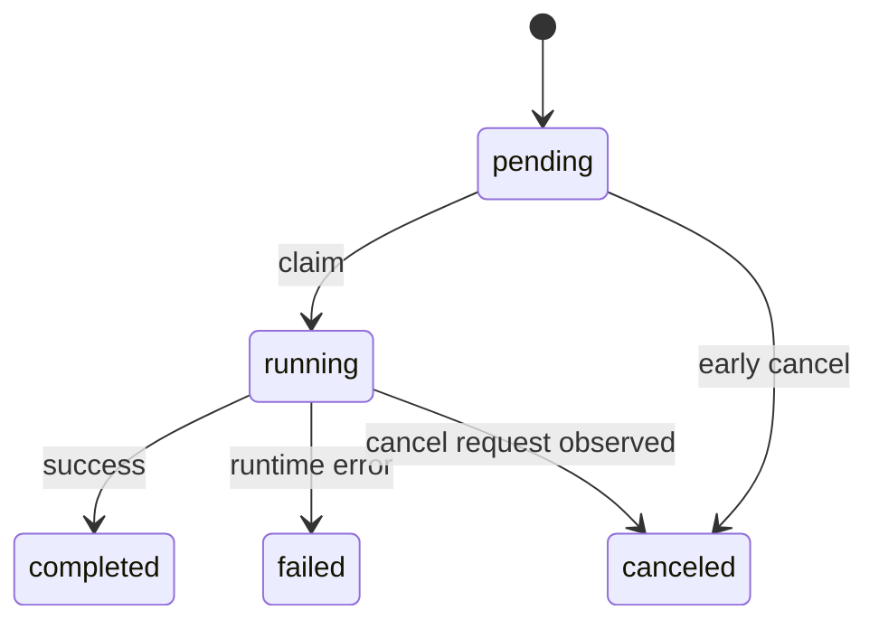

# Job Lifecycle
Last Modified: 2026-02-25

Version: 1.0.0
Last Updated: 01:26:53 | 02/25/2026 EST

## Table of Contents

1. Scope
2. Job Families
3. State Machine
4. Enqueue Flow
5. Claim and Execute Flow
6. Cancellation Model
7. Watchdog and Stale Recovery
8. Worker Lane Runtime
9. Data Model
10. Operational Commands
11. Failure Modes
12. Source Map

## Scope

This document defines lifecycle behavior for async jobs across:

- Crawl
- Extract
- Embed
- Ingest (`github`, `reddit`, `youtube`, `sessions`)
- Refresh (schedule-triggered or manual URL re-checking)

## Job Families

| Family | Table | Queue env var | Primary start path |
|---|---|---|---|
| Crawl | `axon_crawl_jobs` | `AXON_CRAWL_QUEUE` | `start_crawl_job`, `start_crawl_jobs_batch` |
| Extract | `axon_extract_jobs` | `AXON_EXTRACT_QUEUE` | `start_extract_job_with_pool` |
| Embed | `axon_embed_jobs` | `AXON_EMBED_QUEUE` | `start_embed_job_with_pool` |
| Ingest | `axon_ingest_jobs` | `AXON_INGEST_QUEUE` | `start_ingest_job` (`sessions` uses same ingest table and queue) |
| Refresh | `axon_refresh_jobs` | `AXON_REFRESH_QUEUE` | `start_refresh_job` (schedule-triggered), `run_refresh_once` (manual/`--wait true`) |

## State Machine

Statuses are defined in `crates/jobs/status.rs`:

- `pending`
- `running`
- `completed`
- `failed`
- `canceled`



## Enqueue Flow

1. Command validates input and builds `config_json`.
2. Job row is inserted in Postgres as `pending`.
3. Job ID is published to RabbitMQ queue.
4. Worker claims and executes.

Important rule:

- Database is source of truth for job state.
- RabbitMQ message carries only job ID pointer.

## Claim and Execute Flow

Claim uses atomic SQL in `claim_next_pending` / `claim_pending_by_id` (`FOR UPDATE SKIP LOCKED`):

- `pending -> running`
- `started_at` set on first claim
- `updated_at` touched

Execution then updates terminal state:

- success -> `completed`, `finished_at`, `result_json`
- failure -> `failed`, `finished_at`, `error_text`
- cancellation -> `canceled` (implementation depends on family)

## Cancellation Model

Cancellation is dual channel:

- DB status mutation to `canceled`
- Redis cancellation flag (`axon:<type>:cancel:<job_id>`) with TTL

Behavior:

- Crawl workers poll cancellation key periodically during processing.
- Extract and embed workers check cancellation key before expensive work.
- Redis failures do not block DB update.

## Watchdog and Stale Recovery

Stale reclaim is implemented in `crates/jobs/common/watchdog.rs` with two-pass confirmation:

1. Pass 1: stale `running` rows are marked with `_watchdog` metadata in `result_json`.
2. Pass 2: if same `updated_at` remains stale after `confirm_secs`, row is failed with watchdog error text.

Controls:

- `AXON_JOB_STALE_TIMEOUT_SECS`
- `AXON_JOB_STALE_CONFIRM_SECS`

Recovery paths:

- Automatic periodic sweeps in worker lanes.
- Manual recovery commands (`axon <family> recover`).

## Worker Lane Runtime

Generic lane runtime (`crates/jobs/worker_lane.rs`):

- Opens AMQP channel and applies `basic_qos(1)`.
- Uses semaphore + futures set for bounded concurrency.
- Acks after successful claim.
- Nacks with requeue on claim DB error.
- Falls back to polling if AMQP unavailable.
- Runs stale sweeps on interval.

Polling mode:

- Exponential backoff between empty polls.
- Still uses same claim path and semaphore gating.

## Data Model

Full schema lives in `docs/SCHEMA.md`. Summary:

- Shared fields: `id`, `status`, timestamps, `error_text`, `result_json`, `config_json`
- Crawl-specific: `url`
- Extract-specific: `urls_json`
- Embed-specific: `input_text`
- Ingest-specific: `source_type`, `target`
- Refresh-specific: `urls_json` (array of URLs to re-check)
- Refresh targets: `axon_refresh_targets` (per-URL ETag/hash state, separate table)
- Refresh schedules: `axon_refresh_schedules` (recurring schedule definitions, separate table)

## Operational Commands

Crawl/extract/embed support:

```bash
axon <family> status <job_id>
axon <family> cancel <job_id>
axon <family> errors <job_id>
axon <family> list
axon <family> recover
axon <family> cleanup
axon <family> clear
axon <family> worker
```

Ingest aliases route through ingest lifecycle:

```bash
axon github status <job_id>
axon reddit cancel <job_id>
axon youtube list
axon sessions list
```

## Refresh Job Lifecycle

Refresh jobs re-check previously crawled URLs for content changes using HTTP conditional requests and content hashing. They can be triggered by schedules or created manually.

### Creation

- **Schedule-triggered**: The refresh worker periodically calls `claim_due_refresh_schedules()`, which atomically claims enabled schedules whose `next_run_at <= NOW()` using `FOR UPDATE SKIP LOCKED`. For each claimed schedule, a new refresh job is inserted as `pending` and enqueued to AMQP. The schedule's `next_run_at` is advanced by `SCHEDULE_CLAIM_LEASE_SECS` (300s) to prevent duplicate claims.
- **Manual**: `axon refresh <urls...>` creates a job directly via `start_refresh_job()`. With `--wait true`, the job is claimed and processed inline via `run_refresh_once()`.

### Processing

1. Worker claims the job (`pending` -> `running`).
2. A heartbeat task starts, touching `updated_at` every 15 seconds to prevent watchdog reclaim.
3. Previous target state (ETag, Last-Modified, content hash) is loaded from `axon_refresh_targets` for all URLs in the job.
4. Each URL is processed sequentially:
   - HTTP request sent with `If-None-Match` (ETag) and `If-Modified-Since` headers when previous state exists.
   - **304 Not Modified**: counted as `not_modified` + `unchanged`. No content fetched.
   - **2xx with matching content hash**: counted as `unchanged`. Content was fetched but SHA-256 hash matches previous.
   - **2xx with different hash**: counted as `changed`. Markdown is extracted, written to disk, manifest entry appended. If `embed = true`, content is embedded into Qdrant via `embed_text_with_metadata()`.
   - **4xx/5xx**: counted as `failed`. Error text stored in `axon_refresh_targets`.
   - **Network error**: counted as `failed`. Previous state preserved via COALESCE upsert.
5. After each URL, `result_json` is updated with a `"phase": "refreshing"` progress snapshot containing running totals.
6. Per-URL state (ETag, Last-Modified, content hash, last_status, last_checked_at, last_changed_at, error_text) is upserted into `axon_refresh_targets`.

### Completion

- Heartbeat task is stopped.
- `result_json` is finalized with `"phase": "completed"` and full summary stats.
- Job is marked `completed` (or `failed` if the completion update itself fails).
- If schedule-triggered, `mark_refresh_schedule_ran()` updates `last_run_at` and sets `next_run_at` to the actual next interval.

### Related tables

- `axon_refresh_targets`: persists per-URL conditional request state across jobs. No foreign key to jobs — targets accumulate indefinitely.
- `axon_refresh_schedules`: defines recurring refresh configurations. See `docs/SCHEMA.md` for column details.

## Failure Modes

| Job Type | Failure Mode | Symptom | Recovery |
|----------|-------------|---------|----------|
| All | Worker process crash (OOM, panic) | Job stuck in `running` | Watchdog reclaims after `AXON_JOB_STALE_TIMEOUT_SECS` + `AXON_JOB_STALE_CONFIRM_SECS` (default: 360s total) |
| All | AMQP channel dies mid-job | Job stuck in `running`; AMQP lane reconnects with backoff | Watchdog reclaims stale job; worker resumes consuming on new channel |
| All | Postgres connection pool exhausted | Worker hangs waiting for pool slot | Increase pool size; reduce concurrent workers/lanes |
| All | Advisory lock timeout (5s) | Schema init returns error | Retry; investigate long-running migrations |
| Crawl | spider.rs future panics | Job marked `failed` by crawl process error handler | Retry via `axon crawl recover` |
| Refresh | HTTP timeout on all URLs | Job marked `failed` with per-URL error detail in `axon_refresh_targets` | Retry manually or wait for next schedule trigger |
| Ingest | YouTube: yt-dlp not found | Job marked `failed` immediately | Install yt-dlp in the worker container |
| Ingest | GitHub: token rate-limited | Job marked `failed` with 403 | Set `GITHUB_TOKEN` env var for higher rate limits |

## Polling Fallback — Permanent Death Warning

When AMQP is unavailable, workers fall back to Postgres polling. The polling loop
**permanently exits** if the Postgres connection itself fails (e.g., Postgres restart).

Unlike the AMQP reconnect loop (which retries indefinitely with backoff), the
polling loop propagates Postgres errors up to the caller, which returns an error
and causes the worker process to exit.

**Consequence**: A Postgres restart during AMQP-fallback polling **kills the worker
process**. The s6 supervisor will restart the process, but any job in mid-flight
will remain in `running` state until the watchdog reclaims it.

**Recovery**: The watchdog will automatically reclaim stale running jobs after
`AXON_JOB_STALE_TIMEOUT_SECS` + `AXON_JOB_STALE_CONFIRM_SECS` (default: 360s total).

## Source Map

- `crates/jobs/status.rs`
- `crates/jobs/common/job_ops.rs`
- `crates/jobs/common/watchdog.rs`
- `crates/jobs/worker_lane.rs`
- `crates/jobs/crawl/runtime.rs`
- `crates/jobs/extract.rs`
- `crates/jobs/embed.rs`
- `crates/jobs/ingest.rs`
- `crates/jobs/refresh.rs`
- `crates/jobs/refresh/processor.rs`
- `crates/jobs/refresh/schedule.rs`
- `crates/jobs/refresh/state.rs`
- `crates/jobs/refresh/worker.rs`
- `crates/jobs/common/amqp.rs`
- `docs/SCHEMA.md`
