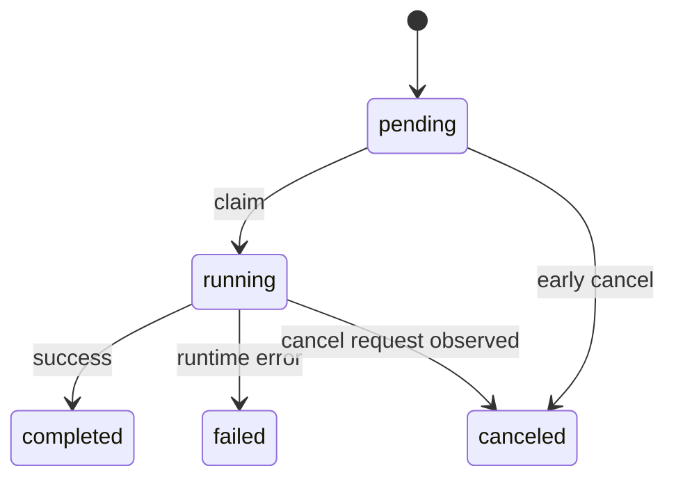

# Job Lifecycle
Last Modified: 2026-02-25

Version: 1.0.0
Last Updated: 01:26:53 | 02/25/2026 EST

## Table of Contents

1. Scope
2. Job Families
3. State Machine
4. Enqueue Flow
5. Claim and Execute Flow
6. Cancellation Model
7. Watchdog and Stale Recovery
8. Worker Lane Runtime
9. Data Model
10. Operational Commands
11. Failure Modes
12. Source Map

## Scope

This document defines lifecycle behavior for async jobs across:

- Crawl
- Extract
- Embed
- Ingest (`github`, `reddit`, `youtube`, `sessions`)

## Job Families

| Family | Table | Queue env var | Primary start path |
|---|---|---|---|
| Crawl | `axon_crawl_jobs` | `AXON_CRAWL_QUEUE` | `start_crawl_job`, `start_crawl_jobs_batch` |
| Extract | `axon_extract_jobs` | `AXON_EXTRACT_QUEUE` | `start_extract_job_with_pool` |
| Embed | `axon_embed_jobs` | `AXON_EMBED_QUEUE` | `start_embed_job_with_pool` |
| Ingest | `axon_ingest_jobs` | `AXON_INGEST_QUEUE` | `start_ingest_job` (`sessions` uses same ingest table and queue) |

## State Machine

Statuses are defined in `crates/jobs/status.rs`:

- `pending`
- `running`
- `completed`
- `failed`
- `canceled`



## Enqueue Flow

1. Command validates input and builds `config_json`.
2. Job row is inserted in Postgres as `pending`.
3. Job ID is published to RabbitMQ queue.
4. Worker claims and executes.

Important rule:

- Database is source of truth for job state.
- RabbitMQ message carries only job ID pointer.

## Claim and Execute Flow

Claim uses atomic SQL in `claim_next_pending` / `claim_pending_by_id` (`FOR UPDATE SKIP LOCKED`):

- `pending -> running`
- `started_at` set on first claim
- `updated_at` touched

Execution then updates terminal state:

- success -> `completed`, `finished_at`, `result_json`
- failure -> `failed`, `finished_at`, `error_text`
- cancellation -> `canceled` (implementation depends on family)

## Cancellation Model

Cancellation is dual channel:

- DB status mutation to `canceled`
- Redis cancellation flag (`axon:<type>:cancel:<job_id>`) with TTL

Behavior:

- Crawl workers poll cancellation key periodically during processing.
- Extract and embed workers check cancellation key before expensive work.
- Redis failures do not block DB update.

## Watchdog and Stale Recovery

Stale reclaim is implemented in `crates/jobs/common/watchdog.rs` with two-pass confirmation:

1. Pass 1: stale `running` rows are marked with `_watchdog` metadata in `result_json`.
2. Pass 2: if same `updated_at` remains stale after `confirm_secs`, row is failed with watchdog error text.

Controls:

- `AXON_JOB_STALE_TIMEOUT_SECS`
- `AXON_JOB_STALE_CONFIRM_SECS`

Recovery paths:

- Automatic periodic sweeps in worker lanes.
- Manual recovery commands (`axon <family> recover`).

## Worker Lane Runtime

Generic lane runtime (`crates/jobs/worker_lane.rs`):

- Opens AMQP channel and applies `basic_qos(1)`.
- Uses semaphore + futures set for bounded concurrency.
- Acks after successful claim.
- Nacks with requeue on claim DB error.
- Falls back to polling if AMQP unavailable.
- Runs stale sweeps on interval.

Polling mode:

- Exponential backoff between empty polls.
- Still uses same claim path and semaphore gating.

## Data Model

Full schema lives in `docs/schema.md`. Summary:

- Shared fields: `id`, `status`, timestamps, `error_text`, `result_json`, `config_json`
- Crawl-specific: `url`
- Extract-specific: `urls_json`
- Embed-specific: `input_text`
- Ingest-specific: `source_type`, `target`

## Operational Commands

Crawl/extract/embed support:

```bash
axon <family> status <job_id>
axon <family> cancel <job_id>
axon <family> errors <job_id>
axon <family> list
axon <family> recover
axon <family> cleanup
axon <family> clear
axon <family> worker
```

Ingest aliases route through ingest lifecycle:

```bash
axon github status <job_id>
axon reddit cancel <job_id>
axon youtube list
axon sessions list
```

## Failure Modes

| Failure | Expected lifecycle result |
|---|---|
| Worker crash after claim | stays `running` until watchdog reclaims to `failed` |
| RabbitMQ outage | workers fallback to polling |
| Redis unavailable on cancel | DB cancellation still applied; worker may finish if it cannot observe flag in time |
| Invalid payload/processing error | `failed` + `error_text` |

## Source Map

- `crates/jobs/status.rs`
- `crates/jobs/common/job_ops.rs`
- `crates/jobs/common/watchdog.rs`
- `crates/jobs/worker_lane.rs`
- `crates/jobs/crawl/runtime.rs`
- `crates/jobs/extract.rs`
- `crates/jobs/embed.rs`
- `crates/jobs/ingest.rs`
- `crates/jobs/common/amqp.rs`
- `docs/schema.md`
